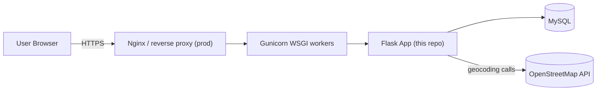

# VPOOL — Architecture

## High-level overview

VPOOL follows a **layered, blueprint-based Flask architecture** that keeps
HTTP concerns, business logic, and data access cleanly separated — the same
pattern used in production Flask services.

```mermaid
flowchart TB
    subgraph Client["Client Layer"]
        Browser["Browser (Bootstrap + Vanilla JS)"]
    end

    subgraph Flask["Flask Application"]
        Routes["Routes / Blueprints\n(auth, user, ride, booking, dashboard, main)"]
        Services["Services\n(business logic: auth, ride, booking,\nmatching, geo, dashboard)"]
        Models["Models (SQLAlchemy ORM)\nUser, Vehicle, Ride, RideRequest, Booking"]
        Utils["Utils\n(validators, decorators, response helpers)"]
    end

    subgraph Data["Data Layer"]
        MySQL[("MySQL Database")]
    end

    subgraph External["External Services"]
        OSM["OpenStreetMap Nominatim\n(Geocoding)"]
        Leaflet["Leaflet.js + Geolocation API\n(client-side map)"]
    end

    Browser -->|HTTP / AJAX (fetch)| Routes
    Routes --> Services
    Services --> Models
    Services --> Utils
    Routes --> Utils
    Models -->|SQLAlchemy ORM| MySQL
    Services -->|geocode / distance| OSM
    Browser --> Leaflet
```

## Why this structure?

| Layer | Responsibility | Example |
|---|---|---|
| **routes/** | Parse HTTP request, call a service, format the HTTP response (HTML or JSON). No business rules live here. | `ride_routes.py` calls `ride_service.offer_ride()` |
| **services/** | All business logic: validation orchestration, cross-model rules, matching algorithm, geocoding. Framework-agnostic (no `request`/`render_template` calls except via passed-in data). | `matching_service.match_rides()` |
| **models/** | SQLAlchemy ORM table definitions + relationships + `to_dict()` serializers. | `models/ride.py` |
| **utils/** | Cross-cutting helpers: input validators, standardized JSON response envelopes, decorators for error handling & JSON auth. | `utils/validators.py` |
| **templates/** | Server-rendered Jinja2 + Bootstrap 5 views. | `templates/rides/ride_details.html` |
| **static/** | CSS, vanilla JS (AJAX calls to the JSON API, Leaflet map rendering, geolocation capture). | `static/js/map.js` |

This separation means:
- Every route has **both an HTML view and a JSON REST endpoint** reusing the
  exact same service function — no logic duplication.
- Services can be unit-tested without spinning up HTTP requests.
- Swapping MySQL for another RDBMS only touches `config.py` (SQLAlchemy URI).

## Request lifecycle (example: joining a ride)

1. **Browser** submits a form (or AJAX call) to `POST /api/rides/<id>/join`.
2. **Route** (`booking_routes.api_join_ride`) authenticates the user via
   `@login_required`, extracts JSON body, calls
   `booking_service.join_ride(current_user, ride_id, data)`.
3. **Service** validates seat availability, checks for duplicate bookings,
   deducts seats from the `Ride`, creates a `Booking` row, commits the
   transaction.
4. **Model** persists changes through SQLAlchemy's unit-of-work / session.
5. **Route** wraps the result in the standard JSON envelope
   (`{success, message, data, errors}`) and returns the correct HTTP status
   code.
6. Validation/permission/lookup errors raised by the service are caught
   centrally by the `@json_endpoint` decorator and converted into clean
   4xx JSON responses — no route needs its own try/except block.

## Authentication & security

- Passwords hashed with Werkzeug's `generate_password_hash` /
  `check_password_hash` (PBKDF2-SHA256 by default) — never stored in plaintext.
- Session-based auth via **Flask-Login**, with `@login_required` (HTML) and a
  JSON-aware `unauthorized_handler` (returns 401 JSON for `/api/*`, redirects
  for HTML pages).
- CSRF protection available via Flask-WTF for form-based flows.
- Ownership checks enforced in the service layer (e.g. only the driver who
  created a ride can cancel it; only the booking's passenger can cancel it).

## Route matching engine

`services/matching_service.py` implements the core algorithm:

1. Filter all `scheduled` rides with enough `available_seats` whose
   `departure_time` falls within a configurable time window (default ±60 min)
   of the passenger's desired departure.
2. For each candidate, compute location match:
   - If both sides have lat/lng coordinates (from geocoding), use the
     **Haversine formula** to compute distance in km and accept if within a
     proximity threshold (default 5 km).
   - Otherwise, fall back to case-insensitive substring matching on the
     location text.
3. Score each match: `score = 2 × (pickup_km + destination_km) + (time_diff_hours)`
   — geographic closeness is weighted more heavily than timing drift.
4. Return matches sorted by ascending score (best match first).

## Deployment view



For local development, `run.py` uses Flask's built-in dev server; in
production, use `gunicorn -w 4 -b 0.0.0.0:8000 run:app` behind Nginx.
