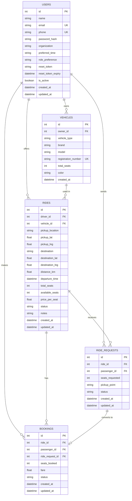

# VPOOL — Entity Relationship Diagram

The schema is implemented with SQLAlchemy ORM models (`app/models/`) and maps
to the following relational structure in MySQL.

## Relationship notes

- **USERS → VEHICLES** (1:N): a user can register multiple vehicles; each
  vehicle has exactly one owner.
- **USERS → RIDES** (1:N, as driver): a user can offer many rides.
- **VEHICLES → RIDES** (1:N): a vehicle can be used across multiple ride
  postings (at different times).
- **USERS → RIDE_REQUESTS** (1:N, as passenger): a user can send many join
  requests.
- **RIDES → RIDE_REQUESTS** (1:N): a ride can receive requests from many
  passengers.
- **RIDE_REQUESTS → BOOKINGS** (1:0..1): an accepted request produces exactly
  one booking; instant-join bookings have no associated request
  (`ride_request_id` is nullable).
- **RIDES → BOOKINGS** (1:N): a ride can have many confirmed bookings, up to
  its seat capacity.

## Constraints implemented

- `users.email`, `users.phone` — UNIQUE
- `vehicles.registration_number` — UNIQUE
- `ride_requests(ride_id, passenger_id)` — UNIQUE composite (prevents duplicate
  pending requests for the same ride by the same passenger)
- All foreign keys (`driver_id`, `owner_id`, `vehicle_id`, `ride_id`,
  `passenger_id`) reference their parent primary keys with cascading deletes
  configured at the ORM relationship level (`cascade="all, delete-orphan"`)
  where a parent removal should clean up dependents (e.g. deleting a user
  removes their vehicles/rides/requests).
